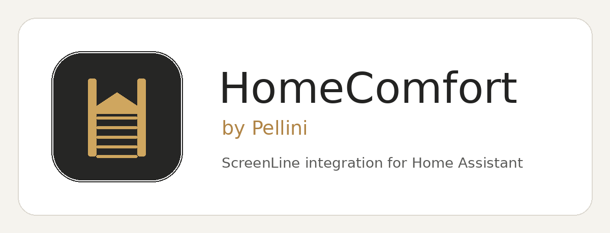

# ScreenLine HomeComfort for Home Assistant

Unofficial Home Assistant integration for Pellini ScreenLine blinds connected through a WISE Hub.



## Version 0.2.1

This release adds HomeComfort-style brand assets for Home Assistant and HACS. It retains the verified cloud login flow introduced in v0.2.0:

1. Sign in with your Pellini/HomeComfort email address and password.
2. The integration retrieves `loginToken` and `registeredHubs`.
3. Select the correct registered WISE Hub.
4. Enter its local IP address or hostname.
5. The token is automatically renewed when the local hub returns HTTP 401/403.

The credentials remain stored in the Home Assistant config entry so the integration can renew the token. Home Assistant stores config-entry data in `.storage`; secure access to your Home Assistant instance accordingly.

### Branding in Home Assistant

Home Assistant 2026.3 or newer loads the integration icon and logo directly from `custom_components/screenline_homecomfort/brand/`. Separate light and dark mode assets are included.

HACS brand assets are also included in the repository-level `brand/` directory.

## Installation with HACS

1. HACS → Integrations → three-dot menu → **Custom repositories**.
2. Add `https://github.com/kn8v7bf65h-art/Screenline-HomeComfort` as an **Integration**.
3. Install **ScreenLine HomeComfort**.
4. Restart Home Assistant.
5. Settings → Devices & services → Add integration → **ScreenLine HomeComfort**.

## Confirmed API calls

Cloud authentication:

```text
POST https://account.pellini.net/wisehubhomecomfort/api/user/login
```

Local WISE Hub:

```text
GET  https://<hub>:8080/api/plant/rooms?includeBlinds=true&includeGlasses=true
POST https://<hub>:8080/api/rooms/{room}/move
POST https://<hub>:8080/api/rooms/{room}/position
POST https://<hub>:8080/api/rooms/{room}/tilt
```

## Notes

- WISE Hub certificates are commonly self-signed; SSL verification is disabled by default.
- Coverage from the hub is converted to Home Assistant cover position (`HA position = 100 - coverage`).
- Tilt uses the confirmed `INCREMENT` and `DECREMENT` API operations.
- This project is unofficial and not affiliated with Pellini S.p.A.
